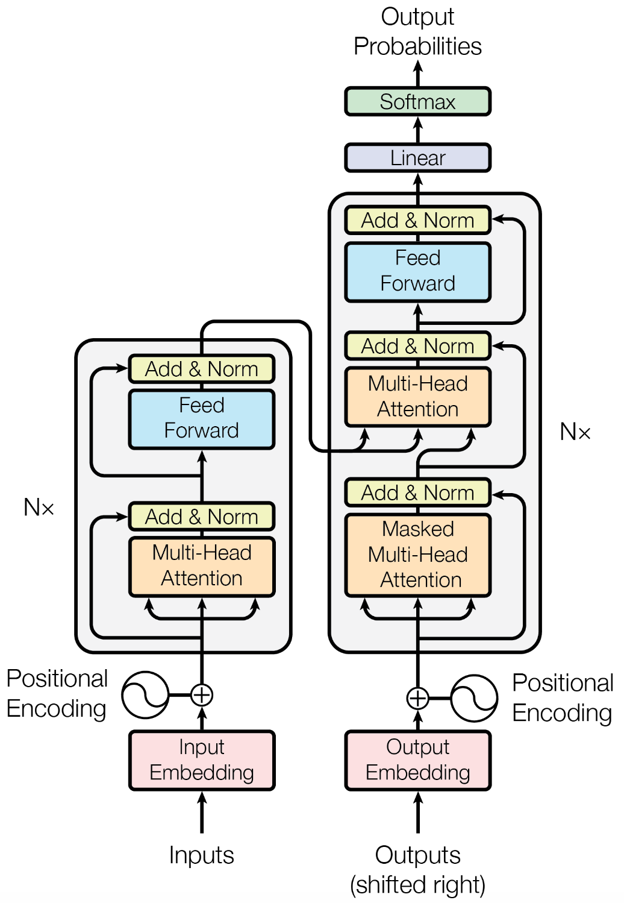
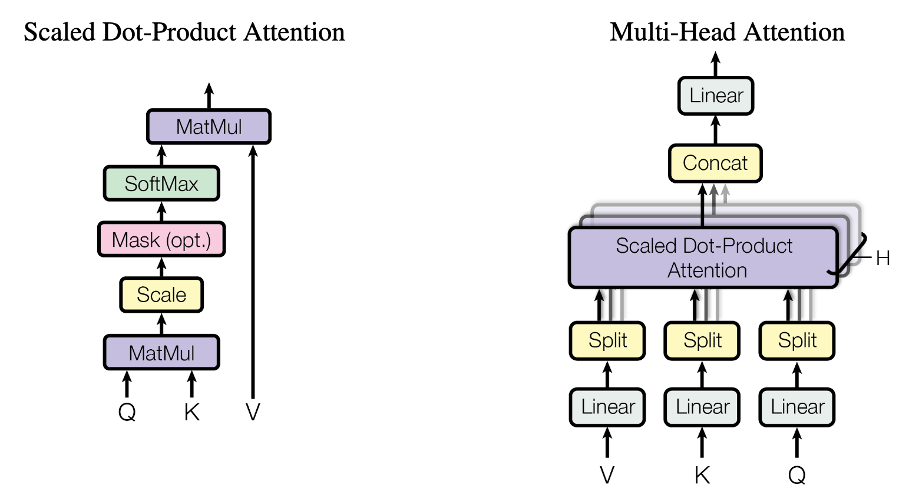

# Transformer

## ✨Introduction

> **Abstract**: The dominant sequence transduction models are based on complex recurrent or convolutional neural networks in an encoder-decoder configuration. The best performing models also connect the encoder and decoder through an attention mechanism. We propose a new simple network architecture, the Transformer, based solely on attention mechanisms, dispensing with recurrence and convolutions entirely. Experiments on two machine translation tasks show these models to be superior in quality while being more parallelizable and requiring significantly less time to train. Our model achieves 28.4 BLEU on the WMT 2014 Englishto-German translation task, improving over the existing best results, including ensembles by over 2 BLEU. On the WMT 2014 English-to-French translation task, our model establishes a new single-model state-of-the-art BLEU score of 41.0 after training for 3.5 days on eight GPUs, a small fraction of the training costs of the best models from the literature. We show that the Transformer generalizes well to other tasks by applying it successfully to English constituency parsing both with large and limited training data.



## 📋TODO List

- [x] Implement basic components (e.g., self-Attention, FFN).
- [x] Implement Transformer encoder and decoder.
- [x] Support basic training on a specific task (toy sequence-reversal task, see `python -m transformer.train` / `python -m transformer.inference`).
- [ ] Train on a real machine translation dataset (e.g. Multi30k).


## 🧑‍💻Implementation


### Attention Mechanism

The basic component of Multi-Head Attention (MHA) is Scaled Dot-Product Attention, which receives Queries  $Q$, Keys $K$, and Values $V$. The attention computation are given by:

$$
\text{Attention}(Q,K,V)=\text{softmax}(\frac{QK^T}{\sqrt{d}})V,
$$

where $Q\in\mathbb{R}^{n\times d}$, $K\in\mathbb{R}^{n\times d}$, and $V\in\mathbb{R}^{n\times d}$. Notably, we can apply optional masking (e.g., padding mask, causal mask) to prevent tokens from attending to unexpected tokens. Basically, there is no trainable parameters in Scaled Dot-Product Attention. Thus, Multi-Head Attention is proposed to add trainable parameters (e.g., QKV projection, output projection).



#### Scaled-Dot Product Attention

```python
class ScaleDotProductAttention(nn.Module):
    def forward(
        self,
        q: torch.Tensor,
        k: torch.Tensor,
        v: torch.Tensor,
        mask: torch.Tensor | None = None,
    ) -> tuple[torch.Tensor, torch.Tensor]:
        """Apply Scaled-Dot Product Attention.

        Args:
            q (torch.Tensor): Query tensor, of shape (B, H, L, D)
            k (torch.Tensor): Key tensor, of shape (B, H, L, D)
            v (torch.Tensor): Value tensor, of shape (B, H, L, D)
            mask (torch.Tensor, optional): Boolean attention mask, 
                of shape (B, 1, 1, L). Defaults to None.

        Returns:
            tuple (torch.Tensor, torch.Tensor): A tuple of attention outputs and attention weights
        """
        d_k = k.size(-1)
        scores: torch.Tensor = q @ k.transpose(-1, -2) * d_k**-0.5

        if mask is not None:
            scores = scores.masked_fill(mask, float("-inf"))

        attn_weights = F.softmax(scores, dim=-1)

        out = attn_weights @ v
        return out, attn_weights
```

#### Multi-Head Attention

```python
class MultiHeadAttention(nn.Module):
    """Multi-Head Attention Module."""

    def __init__(self, d_model: int, n_heads: int):
        super(MultiHeadAttention, self).__init__()
        self.q_proj = nn.Linear(d_model, d_model)
        self.k_proj = nn.Linear(d_model, d_model)
        self.v_proj = nn.Linear(d_model, d_model)
        self.o_proj = nn.Linear(d_model, d_model)
        self.attn = ScaleDotProductAttention()

        self.d_model = d_model
        self.n_heads = n_heads
        self.d_head = self.d_model // self.n_heads

    def forward(self, q: torch.Tensor, k: torch.Tensor, v: torch.Tensor, mask=None):
        # 1. QKV projection and split into H heads.
        q = self._split(self.q_proj(q))
        k = self._split(self.k_proj(k))
        v = self._split(self.v_proj(v))

        # 2. Apply scaled-dot product attention
        out, _ = self.attn(q, k, v, mask=mask)

        # 3. Concat each attention heads.
        out = self._concat(out)
        return out

    def _split(self, x: torch.Tensor) -> torch.Tensor:
        # split tensor into H heads.
        batch_size, seq_len, hidden_dim = x.size()
        out = x.view(batch_size, seq_len, self.n_heads, self.d_head)
        return out.transpose(-2, -3)

    def _concat(self, x: torch.Tensor) -> torch.Tensor:
        # batch_size, n_heads, seq_len, d_head
        batch_size, n_heads, seq_len, d_head = x.size()

        return x.transpose(1, 2).contiguous().view(batch_size, seq_len, self.d_model)
```

### Positionwise Feed-Forward Network

Positionwise Feed-Forward Network (FFN) is a two-layer MLP with ReLU activation.

```python
class PositionwiseFeedForward(nn.Module):
    """Position-wise Feed-Forward Network."""

    def __init__(self, d_model: int, d_ff: int, dropout: float):
        super(PositionwiseFeedForward, self).__init__()
        self.linear1 = nn.Linear(d_model, d_ff)
        self.relu = nn.ReLU()
        self.dropout = nn.Dropout(dropout)
        self.linear2 = nn.Linear(d_ff, d_model)

    def forward(self, x: torch.Tensor):
        out = self.linear1(x)
        out = self.relu(out)
        out = self.dropout(out)
        out = self.linear2(out)
        return out
```

### Positional Encoding

Positional Encoding is neccessary for Transformer-style architectures because attention mechanism is position-agnostic. 

Unlike the widely used relative position embeddings (i.e., RoPEs), vanilla Transformer use absolute position encoding mechanism. Specifically, it uses sinusoidal positional encoding, where even dimensions use sine and odd dimensions use cosine.
$$
\begin{aligned}
\text{PE}_{2i,pos}&=\sin(\frac{pos}{10000^{2i/d}})\\
\text{PE}_{2i+1,pos}&=\cos(\frac{pos}{10000^{2i/d}})
\end{aligned}
$$


```python
class PositionalEncoding(nn.Module):
    """Transformer Sinusoidal Position Embeddings."""

    def __init__(self, d_model: int, max_len: int):
        super(PositionalEncoding, self).__init__()
        self.d_model = d_model
        self.max_len = max_len
        self._init_position_embeddings()

    def _init_position_embeddings(self):
        _2i = torch.arange(0, self.d_model, step=2)
        pos = torch.arange(self.max_len)
        inv_freqs = 1 / 10000 ** (_2i / self.d_model)
        args = pos.unsqueeze(1) * inv_freqs.unsqueeze(0)
        pe = torch.cat([torch.sin(args), torch.cos(args)], dim=1)
        self.register_buffer("pe", pe, persistent=False)

    def forward(self, x: torch.Tensor):
        seq_len = x.size(1)
        pos_emb = self.pe[:seq_len].unsqueeze(0)
        return pos_emb
```

### Transformer Models

Transformer architectures can be divided into three paradigms: (1) Encoder-only (e.g., BERT, ViT); (2) Decoder-only (e.g., GPT, Llama, Qwen); and (3) Encoder-Decoder (e.g., vanilla Transformer). This project is mainly for Encoder-Decoder architecture, although the Decoder-only is prevailing model architecture.

#### Transformer Encoder

```python
class TransformerEncoder(nn.Module):
    """Transformer Encoder."""

    def __init__(
        self,
        vocab_size: int,
        d_model: int,
        n_heads: int,
        n_layers: int,
        d_ff: int,
        max_len: int,
        pad_idx: int,
        dropout: float,
    ):
        super(TransformerEncoder, self).__init__()
        self.emb = TransformerEmbedding(vocab_size, d_model, max_len, pad_idx, dropout)
        self.encoder_blocks = nn.ModuleList(
            [
                TransformerEncoderLayer(d_model, n_heads, d_ff, dropout)
                for _ in range(n_layers)
            ]
        )

    def forward(self, src: torch.Tensor, src_mask=None):
        out = self.emb(src)
        for block in self.encoder_blocks:
            out = block(out, src_mask=src_mask)
        return out
```

#### Transformer Decoder

```python
class TransformerDecoder(nn.Module):
    """Transformer Decoder."""

    def __init__(
        self,
        vocab_size: int,
        d_model: int,
        n_heads: int,
        n_layers: int,
        d_ff: int,
        max_len: int,
        pad_idx: int,
        dropout: float,
    ):
        super(TransformerDecoder, self).__init__()
        self.emb = TransformerEmbedding(vocab_size, d_model, max_len, pad_idx, dropout)
        self.decoder_blocks = nn.ModuleList(
            [
                TransformerDecoderLayer(d_model, n_heads, d_ff, dropout)
                for _ in range(n_layers)
            ]
        )
        self.lm_head = nn.Linear(d_model, vocab_size)

    def forward(
        self,
        dec: torch.Tensor,
        enc: torch.Tensor,
        tgt_mask=None,
        src_mask=None,
    ):
        out = self.emb(dec)
        for block in self.decoder_blocks:
            out = block(out, enc, tgt_mask=tgt_mask, src_mask=src_mask)
        return self.lm_head(out)

```

#### Transformer Encoder-Decoder

```python
class Transformer(nn.Module):
    """Transformer Model (Encoder-Decoder Architecture)."""

    def __init__(self, config: ModelConfig):
        super(Transformer, self).__init__()

        self.encoder = TransformerEncoder(
            vocab_size=config.src_vocab_size,
            d_model=config.d_model,
            n_heads=config.n_heads,
            n_layers=config.n_layers,
            d_ff=config.d_ff,
            max_len=config.max_len,
            dropout=config.dropout,
            pad_idx=config.pad_idx,
        )

        self.decoder = TransformerDecoder(
            vocab_size=config.tgt_vocab_size,
            d_model=config.d_model,
            n_heads=config.n_heads,
            n_layers=config.n_layers,
            d_ff=config.d_ff,
            max_len=config.max_len,
            dropout=config.dropout,
            pad_idx=config.pad_idx,
        )
        self.config = config

    def _make_src_mask(self, src: torch.Tensor):
        return make_pad_mask(src, self.config.pad_idx)

    def _make_tgt_mask(self, tgt: torch.Tensor):
        tgt_seq_len = tgt.size(1)

        pad_mask = make_pad_mask(tgt, self.config.pad_idx)
        causal_mask = make_causal_mask(tgt_seq_len, tgt.device)
        tgt_mask = pad_mask | causal_mask
        return tgt_mask

    def forward(self, src: torch.Tensor, tgt: torch.Tensor):
        # 1. build attention masks
        src_mask = self._make_src_mask(src)
        tgt_mask = self._make_tgt_mask(tgt)

        # 2. encoder & decoder
        enc_out = self.encoder(src, src_mask=src_mask)
        dec_out = self.decoder(tgt, enc_out, tgt_mask=tgt_mask, src_mask=src_mask)

        return dec_out
```


## 👏Acknowledgement

This project is built upon [transformer](https://github.com/hyunwoongko/transformer), a PyTorch implementation of "Attention Is All you Need".
